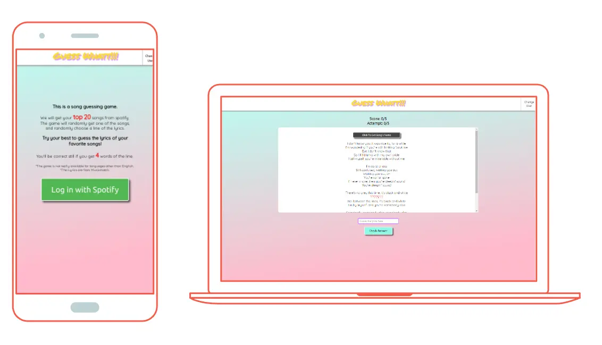

# Hi, I'm Lou!

I am a **web developer**. I always have some crazy ideas 💫✨ in my mind. I make sure that every step I take brings me closer to realize all the ideas and my dream.

## 🗽 My Values

***
    👽 Stay curious.
    👻 Be artistic and creative.
    ⭐ Work harder and go a bit further away from normal to unique.
    🐾 Be kind.
    🌞 We can make a change, and ***I*** can make a change.

## 🌈 Goals For 2022

***

* Dig into more UI/UX design.
* Learn some back-end.
* Going to different café and paint the street views using watercolor.
* Join a band with my acoustic (and electric) guitar.

## 👅 My Dream

***

* Find a solution to hunger by techonology. (I have some little ideas already...)
* Made an side project that combines all my background knowledge annd experience.
* Travel again.

## 🔮 I'm Looking For

***

* Any chances to have a project to collaborate with.
* Some freelance job.

## 📚 My Projects

***

1. [The Alluring experience](https://louuu03.github.io/TheAlluringExperience/)

    Modern love needs modern solution.😤 I came up with this idea: here are couple counsel, wedding planning, surprise planning, and anything you can imagine. We even have services for people who are busy so that the gifts would be sent on the anniversary or any special days you want!! 

    

2. [Guess Whaat!](https://guesswhaat.netlify.app/)🎶

    This is a fun game which gets your top 20 songs from spotify and hides a sentence from the lyrics of a random song in your top 20. You need to type in the right answer to get a point. And I bet you can't get 5 out of 5.😜

    

3. [Wordle Copie](https://wordlecopie.netlify.app/)

    Me and my friends fell for wordle so hard that I decide to make a copy, too. It is a simple clone which I could replace the answer to some weird word.😈

    

4. [Everyday Lil Challenge](https://louuu03.github.io/EverydayLilChallenge/index.html)

    I always love animation so I decide to have some little animation challenge that I can keep updating whenever I see any cool ideas.

    

## ✒️ I'm Currently Working On

***
Just building more different projects.
* E-commerce website
* ...

## 🔍 I'm Currently Learning

***

* Phaser.js
* D3
* More animation

## 📧 How To Reach Me

***

* [Twitter](https://twitter.com/Lou_yiw)
* [LinkedIn](https://www.linkedin.com/in/louc/)
* Or my email: <lou.yiw@gmail.com>

## 🌝 Fun Facts

***

* I can play five instruments🎶(and I have four of them with me).
* I **surfffffff**!🌊 And I just got my first skateboard.
* I was a basketball player of the first league(top level) in university.😉
* I love handcrafting. Hit me up if you find some cool DIY ideas.😚
* Oh, I speak french, quite fluent, too. Hope to find a partner to exchange.
* I have a sociology degree.
* I am a football referee...?
