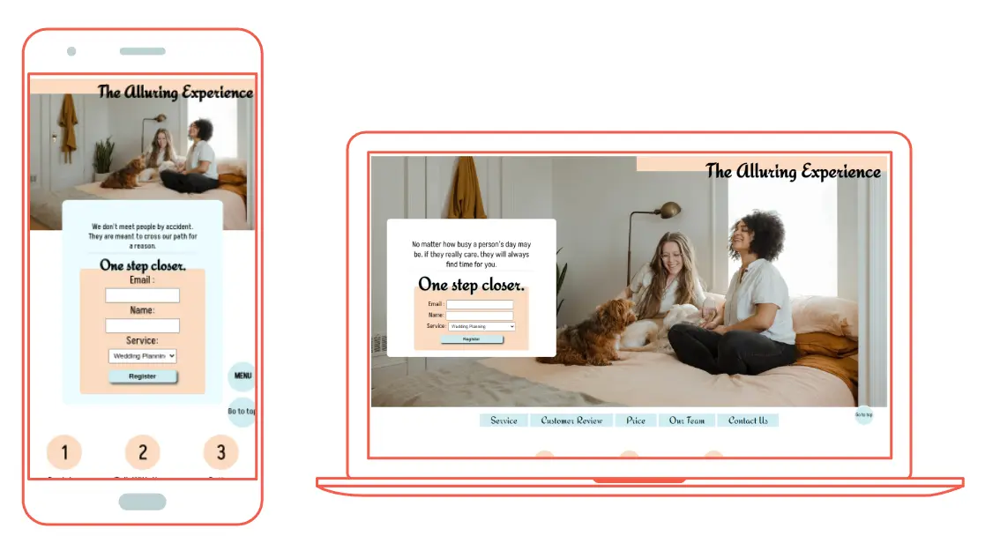
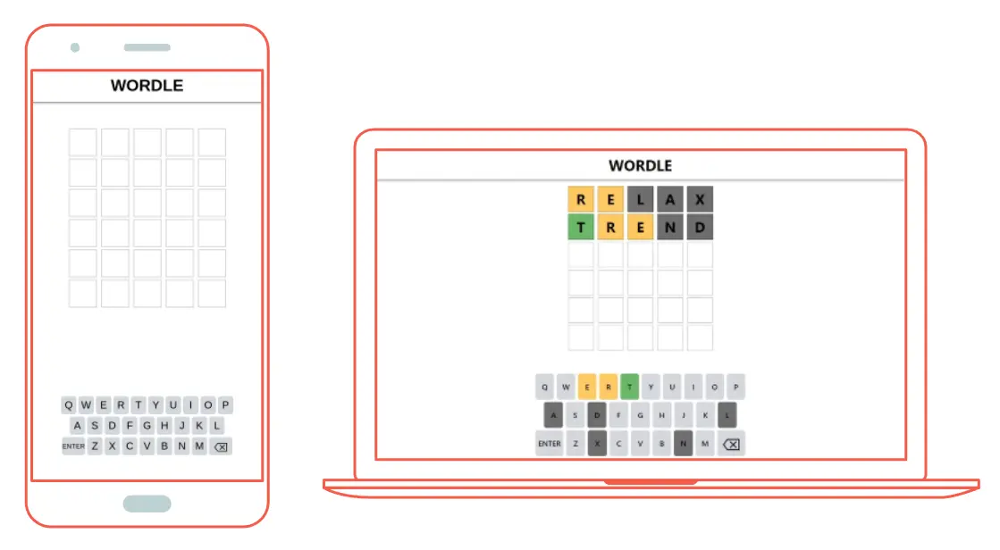
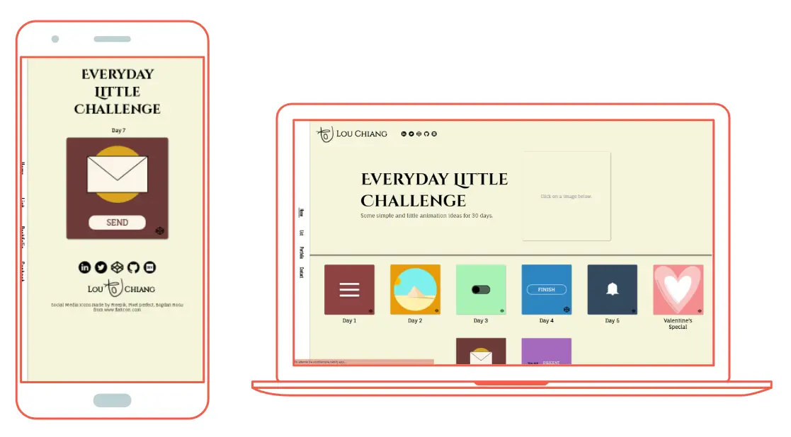

# Hi, I'm Lou!

I am a **web developer**. I always have some crazy ideas 💫✨ in my mind. I make sure that every steps I take brings me closer to realize all the ideas and my dream.

## 🗽 My values

***
    👽 Stay curious.
    👻 Be artistic and creative.
    ⭐ Work harder and go a bit further away from normal to be unique.
    🐾 Be kind
    🌞 We can make a change, and I can make a change.

## 🌈 Goals for 2022

***

* Dig into more UI/UX design.
* Going from front-end to back-end.
* Going to different caffee and water color the street views. 

## 👅 My dream 

***

* Find a solution to hunger by techonology. (I have some little ideas already...)
* Made an side project that combines all my background knowledge annd experience. 
* Travel again.

## 🔮 I'm looking for

***

* An **internship** in front-end.
* Any chances to have a project to collaborate with.
* A mentor if possible.

## 📚 My projects:

***

1. The Alluring experience
    
    Modern love needs modern solution.😤 Couple conunsel, wedding planning, surprise planning, and anything you can imagine. We even have services for people who are busy so that 

    

2. Guess Whaat!🎶

    This is an fun game which get your top 20 songs from spotify and hide a sentence from the lyrics of a random song in your top 20. You need to type in the right answer to get a point. And I bet you can't get 5 out of 5.😜

    

3. Wordle Copie

    Me and my friends fell for wordle so hard that I decide to make a copy, too. It is a simple clone which I could replace the answer to some weird word.😈

    

4. Everyday Lil Challenge

    I always love animation so I decide to have some little animation challenge that I can keep updating whenever I see any cool ideas.
    
    

## ✒️ I'm currently working on

***

Just building more different projects.

## 🔍 I'm currently learning

***

* Typescript
* Sass
* More animation

## 📧 How To Reach Me

***

* [Twitter](https://twitter.com/Lou_yiw)
* [LinkedIn](https://www.linkedin.com/in/louc/)
* Or my email: <lou.yiw@gmail.com>

## 🌝 Fun Facts

***

* I can play five instruments🎶(and I have four of them with me).
* I **surfffffff**!🌊
* I was a basketball player of the first league(top level) in university.😉
* I love handcrafting. Hit me up if you find some cool DIY ideas.😚
* Oh, I speak french, quite fluent, too. Hope to find a partner to exchange.
* I have an sociology degree.